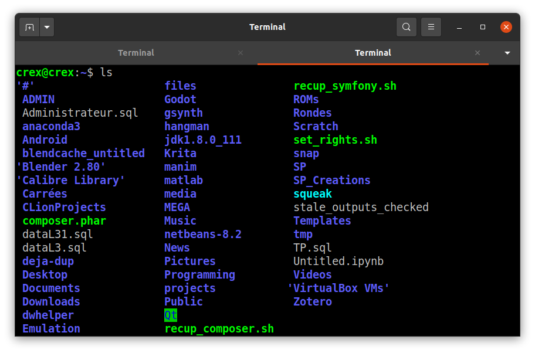

## Bienvenue sur la page Web de GitLearn!

Cette page web est destinée à vous proposer une série d'exercices en accompagnement des modules de formation.

Le module 0 de présentation des VCS étant un module très théorique je n'ai pas vraiment de manipulation technique à proposer. Il s'agit essentiellement de bien comprendre les notions de versionnement, de branches de versions (avec tout ce que ça implique: les fusions de branches, etc.) et de conflits.

Une fois que ce module 0 aura été bien compris, téléchargez et installez Git Bash (utilisateurs Windows) ou Git (utilisateurs Linux) en suivant ce [lien vers le site officiel de Git](https://git-scm.com/) et rejoignez-nous ici!

##### Table des matières
- [Bienvenue sur la page Web de GitLearn!](#bienvenue)
  * [Les terminaux de commande ou CLI](#les-terminaux)
  * [Git : mode d'emploi pour un usage seul, sans dépôt distant, sur une seule branche](#git1)
  * [Git : mode d'emploi pour un usage seul, sans dépôt distant, avec une ou plusieurs branches](#git2)
  * [Git : mode d'emploi pour un usage seul, avec dépôt distant](#git3)
  * [Git : mode d'emploi pour un usage collaboratif](#git4)

<!-- ======================================================================= -->
<!--                              Module 0-1                                 -->
<!-- ======================================================================= -->
### Les terminaux de commande ou CLI 
[Retour à la table des matières](#bienvenue)

Dans Windows ouvrez Git Bash ou un terminal de commande sous Linux (Ctrl + Alt + T). Vous devriez obtenir une fenêtre similaire à celle-ci:

Notez la tilde bleue ~. Cette tidle signifie "HOME" sous Linux. C'est votre dossier HOME. Sous Windows vous aurez probablement un chemin absolu ressemblant à C:\mon\chemin\vers\home.

Vous allez apprendre à vous déplacer dans l'arborescence de vos fichiers dans un terminal. C'est une compétence essentielle pour apprendre Git. En effet, pour utiliser Git sur votre projet il faut vous rendre là où se trouve votre projet. Heureusement deux commandes suffisent à atteindre n'importe quel dossier d'une arborescence.

#### Exercice

- [ ] Dans votre terminal ou votre git bash tapez `ls` puis entrez.

Le résultat de la commande `ls` chez moi donne:

Il ne vous reste plus qu'à taper `cd` suivi du nom du dossier dans lequel vous voulez aller.

#### Exercice

- [ ] Changez de dossier avec la commande `cd`

Pour revenir au dossier précédent entez `cd -`, pour remonter d'un dossier parent dans l'arborescence entrez `cd ..`, pour monter de deux parents entrez `cd ../../`, etc.

#### Exercice

- [ ] Revenez au dossier précédent avec `cd -`
- [ ] Remontez dans le dossier parent avec `cd ..`
- [ ] Remontez au 3ième dossier parent avec `cd ../../../`

<ins>Note:</ins> Si par malheur un de vos dossier commence par le caractère "-" vous pouvez échapper à votre funeste sort en "échappant" le tiret par un antislash, comme ceci: `cd \-nomDossierAvecTiret`.

<!-- ======================================================================= -->
<!--                                Module 1                                 -->
<!-- ======================================================================= -->
### Git : mode d'emploi pour un usage seul, sans dépôt distant, sur une seule branche 
[Retour à la table des matières](#bienvenue)

<!-- ======================================================================= -->
<!--                                Module 2                                 -->
<!-- ======================================================================= -->
### Git : mode d'emploi pour un usage seul, sans dépôt distant, avec une ou plusieurs branches 
[Retour à la table des matières](#bienvenue-sur-la-page-web-de-gitlearn-)

<!-- ======================================================================= -->
<!--                                Module 3                                 -->
<!-- ======================================================================= -->
### Git : mode d'emploi pour un usage seul, avec dépôt distant
[Retour à la table des matières](#bienvenue)

<!-- ======================================================================= -->
<!--                                Module 4                                 -->
<!-- ======================================================================= -->
### Git : mode d'emploi pour un usage collaboratif
[Retour à la table des matières](#bienvenue)
